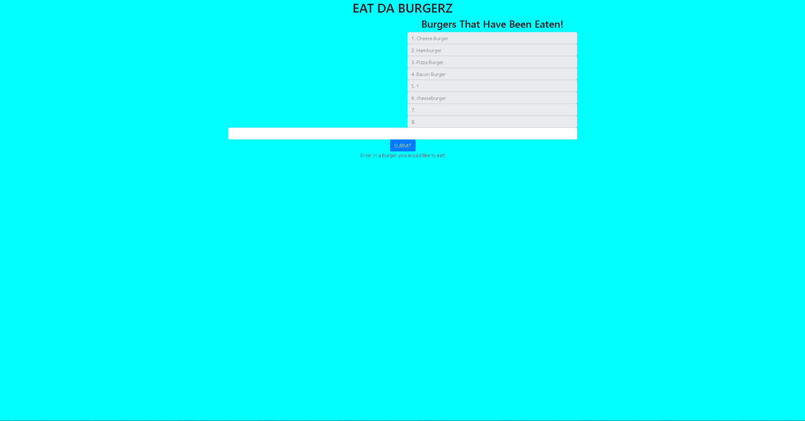

# Tasty Burger
> Burger app that allows you to build a burger and eat it!

Tasty Burger showcases my knowledge of SQL.  The database is rendered via seeds/schema to an sql database.  Users are able to compile their own burger and then it is saved to the list of uneaten burgers.  Clicking the button to eat the burger will move said burger to the eaten field as well as modify the sql database to show it has been eaten.

Link to deployed project https://eatdaburgerzzz.herokuapp.com
